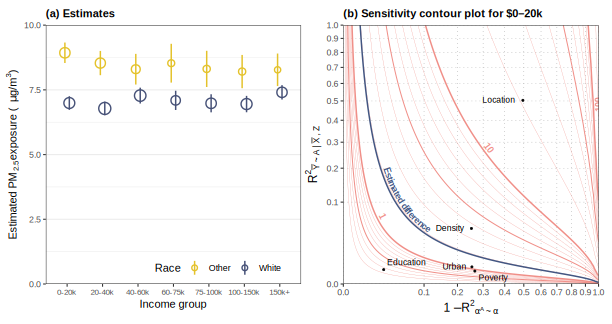

# Best Practices for Computational Research Workflow

This document collects my opinionated recommendations on how to organize and manage data, writing, and code for a computational research project.

**Using this document:**

-   Quickly jump to [**Project setup**](#project-setup), [**Code**](#code), [**Writing**](#writing), or [**Figures**](#figures).
-   I recommend reading the whole document once in order, if you haven't before.
-   If you are viewing this file on GitHub, the upper right corner of this container contains a table-of-contents dropdown.

## General principles

A typical computational research project moves through several phases, sometimes sequentially and sometimes concurrently:

- Exploratory analyses to assist with theory or method development
- Collecting and cleaning data
- Developing code for final simulations and analysis
- Writing the paper
- Writing and packaging code to implement new methods
- Submitting the paper to journals
- Revising the paper

Projects can also produce several types of outputs:

- A paper describing the theory, methods, or results
- Code to carry out paper simulations and analyses
- Public-facing code to implement new methods

A good workflow should support the project through all of these phases and outputs.
I have found that the practices below accomplish that goal in my projects.

Overall, these recommendations are guided by the following principles:

1.  **Staying as lightweight and simple as possible**.
    If you have ever opened up someone else's reproducibility package or project folder to be confronted by hundreds or thousands of files, you understand the value of keeping things organized and simple.
    It should be easy for someone else—or you, after putting the project aside for several months or a year—to find the data or code you need.
    And it should be as easy as possible to move project files around: to collaborators, to a high-performance computing cluster, or to a reproducibility package.
    That means avoiding overly large files, or thinking about other ways to manage large files.

2.  **Tracking project work with version control**.
    Good research inevitably involves backtracking, so being able to keep track of the state of your project over time can be really useful.
    Version control is designed exactly to solve this problem.
    Everyone uses some form of version control, but often it's casual (`paper_v3_final_forreview_FINAL.docx`) or hard to automate and control (Dropbox, Overleaf, or Google Drive versioning).
    Using `git` is more lightweight, more future-proof, gives you more granular control, and enables easy collaboration with coauthors through GitHub.
    Version control frees you up to delete writing, test files, and more, and still be confident that you can bring them back later if you change your mind.

3.  **Keeping an eye on reproducibility**.
    Reproducibility means that other people (or future-you) can recreate your full analysis themselves, given instructions, raw data, and code.
    Achieving full reproducibility often means being able to recreate your exact operating system, package versions, and more.
    While this is not always easily achievable or desirable, trying to maximize reproducibility serves a couple key goals.
    First, at most journals (and ideally all of them), you will be required to submit a reproducibility package, and when your project is designed around reproducibility, this can be as simple as ZIP-ing up your project folder and submitting it.
    Second, reproducibility makes it far easier to make changes to your analysis code, such as when a reviewer (or your coauthor) asks for a variation of an analysis, or when the input data are changed.
    This is especially important when revisiting a project after a long time, when you might have forgotten any manual steps you took to get from raw data to final outputs.
    A reproducible workflow lets your code document all of the steps, and will make your life far easier both during and after working on the project.

4.  **Starting early.** Many people would agree with these principles, but might be inclined to wait until the project outputs need to be shared publicly before implementing them.
    In fact, this leads to much more work and frustration, and avoids the benefits of these practices during the project itself.
    I have found that setting up a project the right way from the get-go leads to minimal overhead and maximum benefits.

## System setup

This document assumes R is your primary analysis language, but most of the advice will be relevant for other languages as well.

You should install [Quarto](https://quarto.org/docs/get-started/), if it is not already installed or included in your IDE (it is bundled with Positron and RStudio).

You should also have `git` installed, and an account on [GitHub](https://github.com) or similar.
I find the [`gh`](https://cli.github.com/) command-line utility useful for managaing GitHub repositories, but many people I work with use [GitHub Desktop](https://github.com/apps/desktop) and like it.

## Project setup

A good folder structure, and system for organizing your files, is the foundation of a good workflow.

### Folder structure

### Using this structure in a new project

To make it easy to set up a new project with this structure, you can use the following script.

## Code

## Writing

### Order of operations

Some projects may naturally lead to a different ordering, but I have found the following sequence to be best for going about writing up a project.

1. Create the paper file early on, and scaffold the main headings, which are almost always the same across papers.

1. As you develop theoretical results, write up the statements of the results and their proofs in the appropriate section of the paper.
As you go, you can also draft "Setup" or "Notation" sections or subsections.
When you are happy with a proof, move it to an appendix section titled "Proofs" and a subsection titled, e.g. `Proof of @prp-yourprop`, which will cross-reference the statement of the result.

1. When you are ready to write the paper, first draft a title.
It should convey the main point of the paper as concisely as possible.
Do _not_ title a paper like "Clever Pun: Vague Description of Topic," which is unfortunately all too common.
Only if the short title or pun is exceptionally clever and well-suited (and therefore likely to increase how memorable your paper is) should you include it.

1. Next, draft an abstract.
The specific analysis findings may not yet be known, but this step allows you to hammer out the framing of the paper and iterate on that framing quickly.
Iterate a lot with your coauthors until you are happy with the abstract.

1. Draft an introduction.
There can be some roughness here, and there may need to be some blank space for specific numerical findings.
Roughly, every sentence of the abstract should become a paragraph in the introduction.

1. Fill out the supporting text in the methods section, and write up simulations, validation, and application, as appropriate.
Since your argument and its key point have been honed in writing the abstract and drafting the introduction, you can make sure to emphasize the key point throughout, and organize your writing around your main argument.
If there are general takeaways that you want to emphasize, including more speculative or intuition-based discussion, you can move these to an unstructured Discussion section at the end.
These are points that are subsidiary to your main argument, or perhaps require reading most of the paper to understand.

1. Write a discussion and finish writing the introduction.
Most discussion sections are short.
Avoid simply summarizing your paper—the introduction has done this more effectively.
In at most one paragraph, you can restate your key argument or contribution and the evidence supporting it.
Then, you can discuss more general points or takeaways for the broader field, as well as directions for future work.
The introduction may need some re-editing at this point.

1. Edit.
Take turns with your coauthors editing the paper section-by-section, focusing on clarity.


### General writing advice
I strongly recommend reading Gopen & Swan's [*The Science of Scientific Writing*](https://cseweb.ucsd.edu/~swanson/papers/science-of-writing.pdf).
It is 16 very readable pages.

Two general but critical principles in technical writing are:

1. **Know your audience.**
When writing a paper, always remember that most readers are skimming your work.
As such, it's important to structure your writing hierarchically, so that readers can locate parts of the paper relevant to them, and understand which points are the most important.
This partly why I recommend drafting an abstract early on in the writing process.
Mechanically, hierarchical structure means adding clear signposting so that readers understand how each section, subsection, and even paragraph relates to the others: is it making a new point, making a contrasting point, supporting a previous point with evidence, filling in new detail, or something else?

1. **Know your argument.**
Your paper is making one or two key points.
Sometimes, these are obvious: "My new method does X better than existing methods."
But it is vital to know the argument you are making, and any subsidiary but important points you want readers to take away, and to make sure that thesse points are made clearly throughout the paper.

Some useful techniques for editing:

1. Give your paper to a friend, and have them read the abstract and introduction in 2 minutes.
Then take the paper away and ask them to tell you the key points of the paper.
If they miss a point that you feel is important, that is a great sign for what needs to be edited.

1. Read your paper aloud.
Not all of it, necessarily, but at least the abstract and introduction.
When you stumble reading part of the paper, your readers will likely stumble there, too.

1. If a paragraph feels hard to read, take a highlighter to it and mark the topic and stress position in each sentence (from Gopen & Swan).
Rephrase individual sentences so that these positions work together coherently and make sense in relation to the larger context of that section.

### Technical writing setup
You should use [Quarto](https://quarto.org/) to write your paper.
Quarto, the successor to R Markdown, enables you to cleanly separate content and formatting, include numerical results from your analysis directly in the text, and has a syntax that is easier to read and type than pure LaTeX (math in Quarto is still written with familiar TeX notation).

<details>
<summary>More on Quarto over TeX</summary>

In TeX, there are no clean and modern solutions for the need to include numerical results from an analysis in the manuscript.
In practice, most people copy in numbers manually, which is error-prone and time consuming.
Even if you think the numbers will be copied once, I can almost guaranteee you will find yourself repeating the process multiple times, and it will not be long before you forget to keep numbers in sync and end up with a mismatch.

On the formatting side, Quarto separates all formatting into template files, of which there are many built-in options.
This way, if you need to reformat for a journal, it can be as easy as changing from, e.g., `format: pdf` to `format: jasa-pdf`.
Sometimes, there are some additional changes, but these are much more minimal compared to reformatting in TeX, where most people intermingle their own TeX definitions with the paper formatting.

This independence of content and formatting also enbales the use of alternative rendering backends.
While TeX is powerful, `pdflatex` and `xelatex` are slow and often require multiple runs to get references and labels right.
New software like [Typst](https://typst.app/docs/) can render documents much more quickly, and is far easier to customize than TeX.
(Quick: how would you change the styling of your headings in TeX? Even with an extension package to help, the syntax is not intuitive and almost impossible to memorize.)

Finally, you can include raw TeX in your Quarto file, so you can ease yourself into the transition by using TeX versions of most Quarto syntax.
</details>

#### Paper formatting
##### Default template
I have built [a Quarto template](https://github.com/CoryMcCartan/cmc-article/) that can render both into Typst (faster) and TeX.
You can add it by running `quarto add CoryMcCartan/cmc-article` from the `paper/` folder.
Then you can specify `format: cmc-article-typst` or `format: cmc-article-pdf` in the YAML header of your Quarto file.

##### Typst versus TeX
I recommend using the Typst format to start, since it renders much faster.
For arXiv submissions, you may want to switch to TeX, so that you can submit the source files and your paper will be rendered to HTML.
For journal submission, you will likely need to swap out the template for a journal-specific TeX one.

To include your own macros in Typst or tweak the formatting, create a file `paper/_header.md`:

````markdown
::: {.content-visible when-format="typst"}
```{{=typst}}
// Any Typst-specific formatting code here
```

<!-- TeX macros here, e.g.-->
\newcommand{\F}{\mathcal{F}}
:::
````

Include this file in the manuscript by putting `` at the top of your Quarto file, after the YAML header.

For TeX, you can create a `header.tex` file with the same macro definitions, and include it with `include-in-header: header.tex` under the `format: cmc-article-pdf` section of your YAML header.

I have not yet experimented with ways to avoid copying macros from one file to the other when changing formats, but some kind of `` in the `.md` syntax might work.
This is a relatively rare operation, thankfully.

##### Journal templates
When it comes time to submit to a journal, check and see if there is already a Quarto template for that journal.
You can look at the [official repository](https://github.com/quarto-journals/), or [search all of GitHub](https://github.com/search?q=topic%3Aquarto-template+journal&type=repositories).
If not, you can make your own without too much trouble by following the instructions in the [Quarto documentation](https://quarto.org/docs/journals/formats.html).
The most work is usually spent forwarding the author metadata into the right part of the template.
If you do so, save your template to its own repository and publish it so that you and others can avoid doing this work twice!

#### Quarto best practices
In general, the Quarto documentation is excellent.
The [guide](https://quarto.org/docs/guide/) covers all of the key features for scientific writing, and the [reference](https://quarto.org/docs/reference/) documents format-specific YAML options.

##### Don't repeat yourself
Make a macro for any notation you are going to use multiple times.
It saves typing and especially saves headaches if you ever decide to change your notation.

##### Line wrapping
I recommend writing each sentence on a single line.
Compared to writing each paragraph on a line, this aids in tracking edits in version control.
Compared to manually wrapping lines to e.g. 80 characters, it avoids unnecessary version control noise.
If you use the Quarto visual editor in RStudio or Positron, there is an option to automatically wrap lines at the sentence level.

##### Equations
For display math, use
```md
We know from arithmetic that
$$
1 + 1 = 2,
$$ {#eq-1p1}
but what is $1 + 2$?
```
The trailing `{#eq-1p1}` is optional, but allows you to reference the equation with `@eq-1p1` and have it automatically numbered.

When you have multiple equations to align, the current best practice in Quarto is
```md
$$
\begin{aligned}
a + b &= c \\
d + e &= f
\end{aligned}
$$
```
One drawback is that labeling this equation will label all lines.
You can try using `\begin{align}` and no surrounding `$$`, but this will not work in Typst.

##### Citations
You reference papers with `@key`, where `key` is the key for the paper in your BibTeX file.
For parenthetical cites, use `[@key]`.
For multiple parenthetical cites, use `[@key1; @key2]`.
You can reference the year only (in parentheses) with `[-@key]`.
[Read more](https://pandoc.org/MANUAL.html#citations).

##### Cross references
Add `{#key}` to the end of a section to be able to cross-reference it with `@sec-key`.

Don't use `\begin{figure}`, `\begin{table}` environments, as these are more verbose and aren't portable across rendering formats.
They also require more verbose cross-referencing.
If you make a figure, table, or theorem with Quarto syntax, you can cross reference with `@fig-key`, `@tbl-key`, `@thm-key`, etc.
[Read more](https://quarto.org/docs/authoring/cross-references.html).

The basic format for figures:
```md
![Caption]{#fig-key}
```
If you generate the figure from an R chunk, then the syntax is
````md
```{{r fig-key}}
#| fig-cap: |
#|   Figure caption here.
ggplot(...) + ...
```
````

The similar syntax is used for tables generated from R, but with `tbl-` instead of `fig-`.

The basic format for mathematical results is
```md
::: {#thm-key}
# Optional theorem title

Theorem statement.
:::

::: {.proof}
Proof here.
:::
```


##### Appendix references
You can add a label to an appendix section just as with the main text: `{#sec-sectionkey}`.
Then you can reference it with `[Appendix @sec-sectionkey]`, which will render as, e.g., `Appendix A` (as long as your template file is configured properly to use lettered appendices).

However, when the paper is accepted at a journal, the appendices will be separated and published as an independent PDF.
You will have to manually remove references to the appendices from the main text.
It is far easier to avoid this by writing the main text without any references to specific appendix sections.
A good table of contents in the appendix will take care of the rest.
It's harder to avoid making to include cross-references from the appendix to the main text, but at least at the paper acceptance stage you will only have to edit one document.


## Figures

### Design principles

To start, I highly recommend reading Franconeri et al.'s [*The Science of Visual Data Communication: What Works*](https://doi.org/10.1177/15291006211051956).
There are many other excellent resources on general graphic design.
I also recommend looking at figures produced by news media data teams, who are experts in communicating data to lay audiences, and who pay attention to the details of figure design.

The two overriding principles of paper writing also apply to designing figures:

1. **Know your audience.**
The typical reader of your paper has far less background knowledge of the project than you do, and is skimming your paper to quickly understand the main points.
This means that figures need to be understandable without reading the main text, and should be as simple as possible.

1. **Know your argument.**
You can include a limited number of figures in each paper, so every one shoud contribute to the overall argument you are making.
Make sure can describe, for each figure, the argument or point it is making, and make sure your choices about how to encode data into figure aesthetics (position, color, size, etc.) are intentional and support that argument.

Several additional principles that are to varying degrees more figure-specific:

- **Strip out what you do not need**: extra colors, grid lines, redundant aesthetics, etc.
- **Minimal legends.** The most minimal legend is direct labeling of figure elements, which you should use whenever possible.
  Legends can also often be overlaid into blank space in the figure, which saves space.

Consider the following figure, which is excerpted from a paper of mine.



Things to learn from this figure:

- Directly label points and contours rather than relying on the figure caption to explain every element of the figure.
- Use `plotmath` to make your axis labels as good as possible: here, they use subscripts and superscripts and math notation.
Make labels as concise as possible, as is done in panel (a) for the income groups.
- When you have a discrete variable on the X or Y axis, it usually does not need gridlines, unless there are many, many groups (and then, think about only including gridlines every few levels).
- Reduce the visual weight of gridlines by making them lighter, thinner, or dashed (as in panel  (b)).
- Open circles can allow small confidence intervals to remain visible.

Things the figure could improve on:

- It might have been better to directly label the White and Other estimates in panel (a), especially since they are vertically separated.
- The label on the 100 contour in panel (b) is cut off on the edge of the figure.

### Captioning
A good figure caption should start with a short noun-phrase summary of the figure, and where possible, you should bold this summary.
Then, other parts of figure should be explained in enough detail that a reader can understand the figure without needing to read the main text.
When there are subfigures, repeat this for each subfigure.

For example, the caption for the figure above was

> **Figure 3: (a) Estimates of pollution exposure by race and income group.**
> Circles are centered at the estimate and have area proportional to the size of each group in the U.S. population.
> Vertical lines display 95% confidence intervals.
> **(b) Sensitivity analysis for the racial disparity in exposure among people earning less than $20,000.**
> The two sensitivity parameters plotted along each axis, and the contours indicate the bias in the estimated difference (Other – White) that would arise from the specified degree of confounding.
> The blue contour corresponds to bias that would be sufficient for the estimated disparity to be zero.
> Benchmarked sensitivity parameters for observed covariates are also plotted.

### Generating figures in R
Always use [`ggplot2`](https://ggplot2.tidyverse.org/) to generate figures: while it is more verbose for simple plots, you can easily edit iteratively to produce a production-quality figure, which is *much* harder and more fragile using other systems like `matplotlib` or base R.

One package I almost always use in conjunction with `ggplot` is [`patchwork`](https://cran.r-project.org/web/packages/patchwork/index.html), which makes it easy to combine multiple `ggplot` objects into a single figure:

```r
library(patchwork)

p1 = ggplot(...) + ...
p2 = ggplot(...) + ...

# Patchwork will lay out `p1` and `p2` side by side
p = p1 + p2

ggsave("paper/figures/fig.pdf", plot = p, width = 6.5, height = 4)
```

While it is possible to achieve multi-panel figures within Quarto, journals will often want subfigures combined into a single file anyway, and it is faster to produce them and ensure consistent layout using `patchwork` than to do it in Quarto.

### Tips and tricks for `ggplot`

- The [`ggrepel`](https://ggrepel.slowkow.com/) package is very useful for direct labeling of points, as it will automatically adjust label positions to avoid overlaps.

- The [`geomtextpath`](https://allancameron.github.io/geomtextpath/) package is very useful for direct labeling of lines, including not just reference lines but also data lines that may be irregularly shaped.

- For discrete variables, pre-define human-readable labels or colors as a named vector.
For example, if a party variable is stored with levels `"dem"` and `"rep"`, you can define `PARTIES = c(dem = "Democrats", rep = "Republicans")` and `PAL_PARTY = c(dem = "blue", rep = "red")`, and then use `scale_color_manual(values = PAL_PARTY, labels = PARTIES)` in your `ggplot` code.
Or you can directly substitute into the aesthetic, such as `aes(x = PARTIES[party])`.

- The new `ggplot` 4.0 lets you pre-define variable labels by setting their `label` attribute.
So if you set `attr(df$species, "label") <- "Penguin Species"` and plot with `aes(x = species)`, then the x-axis title will be "Penguin Species" and not "species."

- Don't repeat yourself!
Create helper functions which create parts of a plot, then call the helpers and add them to your plot.
For example, if two figures share the same setup code but use different limits, you can move all of the shared code to a function `plot_fig()`, and then build each figure with `plot_fig() + limits(...)`.
You can also make your helper function accept arguments such as limits, or axis titles, etc.

### Color palettes

Try to keep your use of color intentional, and the number of distinct colors to a minimum.
It is also helpful to readers when the same color has the same meaning across figures, e.g. purple for the new method and gray for baseline methods.
Balancing these two considerations can be a bit tricky.

Keep in mind that about 1 in 20 of your readers (likely more, because our fields do not have gender parity) will have some form of color blindness and will have difficulty distinguishing certain colors.
I have built an R package [`wacolors`](https://cran.r-project.org/package=wacolors) with a selection of colorblind-friendly palettes.
You can browse the options [here](https://cran.r-project.org/web/packages/wacolors/refman/wacolors.html#wacolors) or with `?wacolors`.
A few reasonable options to start with are these:


You can copy palette colors directly from the package, or use the built-in `ggplot`-compatible `scale_` functions.
When using a discrete palettes, still try to keep the number of distinct colors to a minimum, as there are different kinds of colorblindness and some combinations may still be difficult to distinguish.
Also keep in mind that smaller elements (dots, lines) will be harder to distinguish on the basis of color than larger areas like bars or regions on a map.
Larger areas often should use lighter colors and palettes as well (you can often lighten yourself by setting `alpha` to a value less than 1), compared to points or lines.

I recommend setting up color palettes as character vectors in your setup file, so that they can be edited globally and are available to all figure-producing code.

### Figure theming

`ggplot` supports theming functions, which can apply consistent styling to all of your figures.
The default "gray" theme is fine for exploratory figures, but does not look good in a paper.
To produce figures that look more like what is found in scientific papers, I recommend using `theme_bw()`, perhaps with additional modification.

Just as with color palettes, you can set up a custom theme in your setup file, with something like
```r
theme_paper <- function(base_size = 10, ...) {
    theme_bw(
        base_size = base_size,
        palette.color.discrete = PAL_DISCRETE,
        palette.fill.discrete = PAL_DISCRETE,
        palette.color.continuous = PAL_CONTINUOUS,
        palette.fill.continuous = PAL_CONTINUOUS,
        ...
    )
}
```
Then you can add `+ theme_paper()` to your other plot code and be assured of consistent styling.
Since `ggplot` 4.0, you can include your default color palette in your theme, as demonstrated above.


### Exporting figures

Figure export is done via `ggsave` and should *always* be to a PDF file.

<details>
<summary>Why PDF?</summary>
Saving figures as PDFs (or very rarely, when there are PDF bugs, as SVGs) is preferable to PNGs for a few reasons.

1.  File sizes are smaller, so `git` syncs faster and your repository uses less disk space
2.  PDF figuress avoids grainy images in the paper PDF and reduces the paper PDF file size
3.  Many journals need high-res images and prefer you to provide PDFs anyway
</details>

You should always specify a `height` and `width`, which are measured in inches by default.
For most figures, I use `width=6.5`, which is the width of the text block on letter-sized pages.
If the figure will not be occupying the full width, you can use a smaller number.
Always using the same width ensures that the text size in your figures will be consistent across figures and will match your paper text.

Sometimes, you may wish to remove the default small amount of padding included around a figure by `ggplot`.
This can be done by providing `plot.margin = margin()` to `theme()` (the default `margin()` is all zeros).
Some care is needed when doing this by subfigure in `patchwork`, to ensure proper spacing *between* subfigures and to remove the global margin around the whole figure.